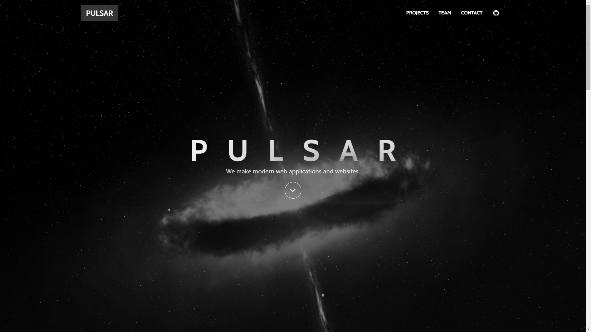

# Pulsar Landing

> The landing page for Pulsar.
> Made with Bulma, Vue.js and Nuxt.js.

[](https://pulsar.surge.sh/)

## Table of Contents

- [Build Setup](#build-setup)
- [Something Missing?](#something-missing)

## Build Setup

``` bash
# install dependencies
$ npm install # Or yarn install

# serve with hot reload at localhost:3000
$ npm run dev

# build for production and launch server
$ npm run build
$ npm start

# generate static project
$ npm run generate
```

For detailed explanation on how things work, checkout the [Nuxt.js docs](https://github.com/nuxt/nuxt.js).

## Something Missing?

If you have a feature request or found a bug, [let me know](https://github.com/pulsardev/pulsar-landing/issues).
